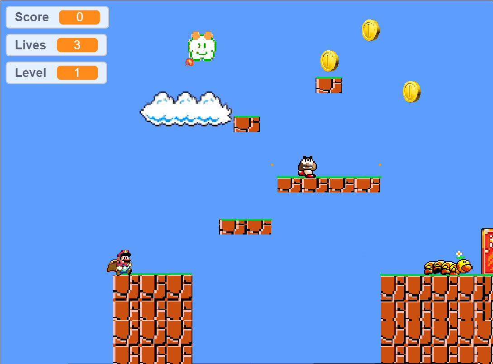
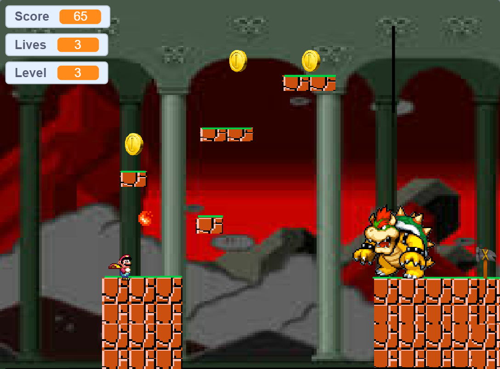

# SuperMario_game_ScratchProject
Designed Super Maio Game in Scratch 3 with UI and Score saving between levels algorithm 

## Pre-Requisities
Scratch - IDE

### **Setup**
* Install Scratch 3 or load the .sb2 file on online Scratch 3 tool.
* Execute the game within the IDE using the green flag.

### **Screenshots**

